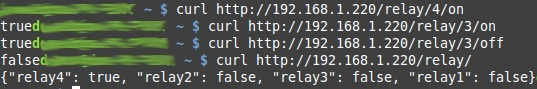

# iRelay

iRelay start a Rest Web Server on the WiPy 1 to control a quad relay board. 

We recommend to start the project from REPL session with the following commands for testing purpose:

```python
>>> from irelay import *
>>> from restsvr import rest_server
>>> rest_server( irelay_actions, debug=True )
```

IF you copy the main-irelay.py file as __main.py__ THEN the project supports an automatic startup when GP8 is connected to the GND.

# How to install 
Copy the following files to your WiPy
* lib/restsvr.py to /flash/lib/
* lib/irelay.py to /flash/lib/

If you want to automagically start the Rest Server then copy (and do not forget to place GP8 on the ground)
* doc/irelay/main-irelay.py to /flash/main.py 

# Wiring
The project currently support 2 differents relay board. Here the corresponding wirings schema


# Rest API

## Activate/Unactivate relay

```
http://<ip>/relay/<relay_num>/<state>
```

* __ip__: the IP of your WiPy
* __relay_num__: Number of the relay (from 1 to 4)
* __state__: use _on_ to activate, _off_ to deactivate the relay

Example:
* http://192.168.1.220/relay/1/on
* http://192.168.1.220/relay/3/off
* http://192.168.1.220/relay/3/on

The server will return a JSON boolean True/False value reflecting the actual state of the relay.

## Getting state of a relay

http://<ip>/relay/<relay_num>

* __ip__: the IP of your WiPy
* __relay_num__: Number of the relay (from 1 to 4)

Example:
* http://192.168.1.220/relay/3/

The server will return a JSON boolean True/False value reflecting the actual state of the relay.

## Getting state of all the relay

http://<ip>/relay/

* __ip__: the IP of your WiPy

Example:
* http://192.168.1.220/relay/

The server will return a JSON structure with the state of all the relay on the board.

```
{"relay4": true, "relay2": true, "relay3": false, "relay1": true}
```

## Halting the Rest Server

http://<ip>/exit

* __ip__: the IP of your WiPy

Example:
* http://192.168.1.220/exit

Terminates the execution of rest_server(). This call is only allowed when rest_server() is called with debug=True

When the function terminates, you will receive this html message:

```
rest_server exit!
```

# Test

## Test with Firefox

You can enter REST request directly in your favorite browser.


## Test with curl

[Curl](https://fr.wikipedia.org/wiki/CURL) (Client Url Request Library) is a command line tool used to fetch ressource content from network. You can use curl from your Linux machine (ex: Raspberry-Pi under Raspbian) to interact with the iRelay project

```
curl http://192.168.1.220/relay/4/on
curl http://192.168.1.220/relay/3/on
curl http://192.168.1.220/relay/3/off
curl http://192.168.1.220/relay/
```
 
All thoses commands returns the request's result on the screen. Here a sample



## Test with Python

By running Python on your computer (or Raspberry-Pi), you will be able to send request to the Rest Server and grab the response. 

Those samples is based on the __requests__ module that can be installed with the following commands (sudo may be necessary on some plateform).

```
pip install requests
```

This sample activate the second relay and display the content results... this should be a string containing the value 'true' or 'false' (the JSON value for True and False)

```
>>> import requests as rq
>>> wipy_ip = '192.168.1.220'
>>> r = rq.get( 'http://%s/relay/2/on' % wipy_ip )
>>> print( r.content )
false
```

This sample use the requests and json to convert back the json result in a python dictionnary:

```
>>> import requests as rq
>>> import json
>>> wipy_ip = '192.168.1.220'
>>> r = rq.get( 'http://%s/relay/' % wipy_ip )
>>> r.content
'{"relay4": false, "relay2": false, "relay3": false, "relay1": false}'
>>> j = json.loads( r.content )
>>> j
{u'relay4': False, u'relay3': False, u'relay2': False, u'relay1': False}
>>> j['relay2']
False
>>> for k, v in j.items():
...     print( "%s is %s" % (k,'ON' if v else 'OFF') )
... 
relay4 is OFF
relay3 is OFF
relay2 is OFF
relay1 is OFF
```

In the following sample, we will activate all the relay, wait 2 seconds then deactivate all the relay. This cycle is repeated twice.

Don't forget to change the IP to match your WiPy's IP address.

```
>>> import requests as rq
>>> import time
>>> relays = [1,2,3,4]
>>> for i in range( 4 ):
...     state = 'on' if (i%2)==0 else 'off'
...     for relay in relays:
...         r = rq.get( 'http://192.168.1.220/relay/%s/%s' %(relay,state) )
...         time.sleep( 0.3 )
...     time.sleep( 2 )
... 
>>> 
```


